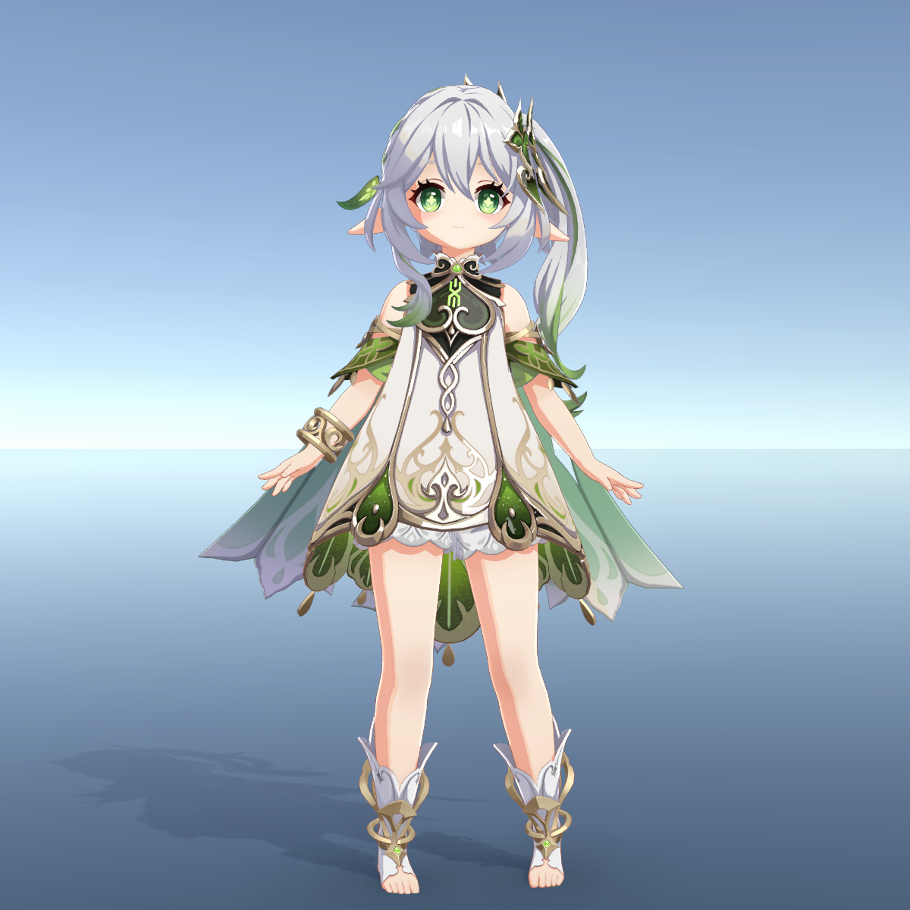
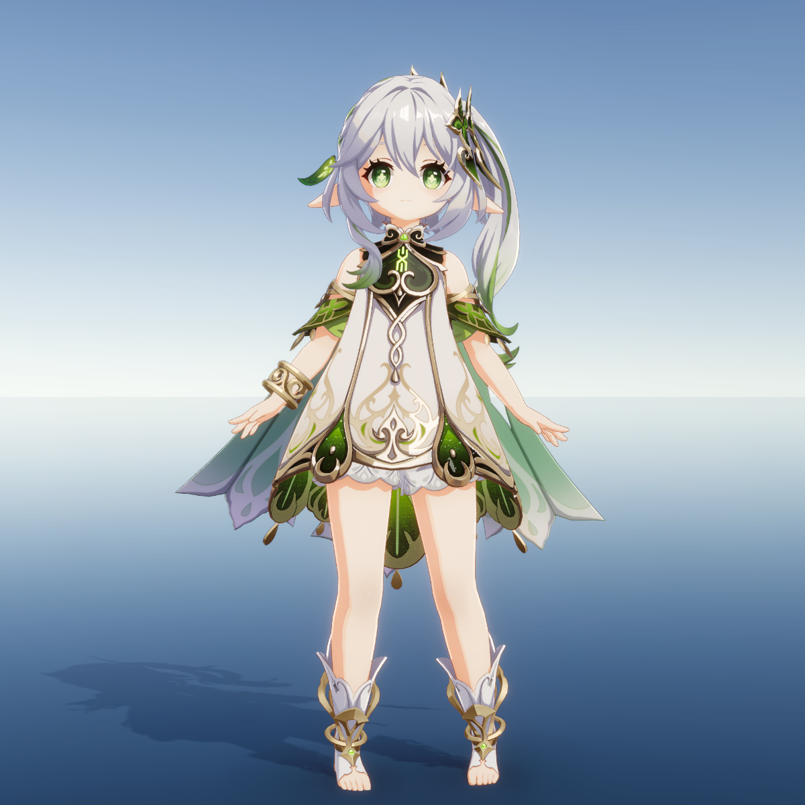

# UnityGenshinToonShader

A custom genshin-like toon shader, based on URP

基于 URP 的仿原神风格化渲染着色器

## Supported Features

- **Light Map** (R / B for specular, G for AO, A for material type)
- **Shadow Ramp**
- **Emission**
- **Normal Map**
- **Face Shadow**, based on SDF Light Map
- **Face Blush**
- **Nonmetallic and Metallic Specular**, based on Blinn-Phong Model
- **Rim Light**, based on Depth Texture and Fresnel
- **Outline**, based on Back Facing
- **Double-Sided Rendering**

## Scripts

- **MaterialUpdater** : pass face direction to material

## Render Example

without post-processing:

with post-processing:
